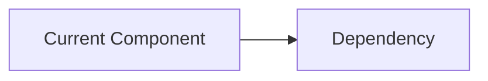
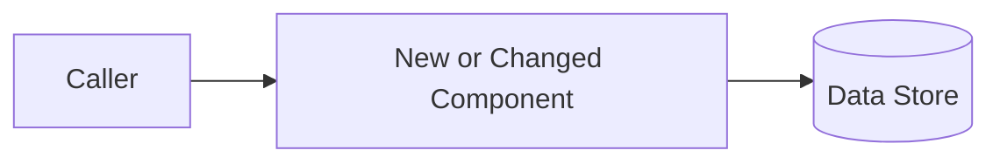

# Software Design Document Template

Use this as a menu. Delete sections that are irrelevant and add project-specific sections when needed.

# <Project / Change Name>

## Metadata

- **Status:** Draft | In Review | Approved | Superseded
- **Author(s):** <name or team if known>
- **Created:** <date if known>
- **Last updated:** <date if known>
- **Reviewers / approvers:** <if applicable>
- **Related documents:** <links or repository paths>
- **Evidence sources:** <docs, code areas, tickets, user-provided requirements, etc.>

## Objective

One sentence explaining the purpose of the change in language understandable to a stakeholder who is not already familiar with the implementation.

## Background / Problem

Explain the current situation, why the work is needed, and the evidence that motivates the change.

For greenfield projects, describe the problem space and motivation without inventing a nonexistent current architecture.

Include only context required to understand the design.

## Goals

Describe desired outcomes, preferably measurable where practical.

- <outcome>
- <outcome>

## Non-goals

State plausible expectations that are intentionally outside scope.

- <non-goal and why it is excluded>

## Requirements

Include only requirements that materially constrain or validate the design.

### Functional requirements

- <required behavior>

### Quality / operational requirements

- <reliability, latency, scale, maintainability, compatibility, or other requirement when relevant>

## Assumptions and Constraints

Keep assumptions distinct from known constraints.

### Assumptions

- <unverified but explicit working assumption>

### Constraints

- <technical / organizational / cost / compatibility constraint>

## Scenarios / Use Cases

Describe representative end-to-end behavior from the user's or calling system's perspective.

### Scenario: <name>

1. ...
2. ...
3. ...

## Current Architecture

Include this section only when a current system or relevant baseline actually exists.

Summarize only the current components relevant to the proposed change.

## Proposed Design

Explain the design at the level required to review consequential decisions.

### Architecture

### Key design decisions

#### Decision: <short name>

- **Choice:** <what is proposed>
- **Why:** <rationale>
- **Evidence / constraints:** <facts that drive the choice>
- **Cost of being wrong:** <what becomes expensive/risky if this is incorrect>
- **Reversibility:** Easy | Moderate | Hard

### Interfaces

Document externally meaningful contracts: API semantics, events, CLI behavior, file formats, schemas, or public types.

### Data Model and Persistence

Describe persisted state, ownership, schema evolution, consistency expectations, retention, and migration implications when relevant.

### Concurrency / Consistency

Describe ordering, concurrency control, idempotency, retries, deduplication, transactions, or consistency semantics when relevant.

### Dependencies / Infrastructure

Document dependencies that materially affect complexity, cost, lock-in, operability, or maintenance.

## Reliability and Performance

### Service-Level Objectives / Targets

Use measurable targets when meaningful. Do not invent targets that have not been established.

- **Availability:** <target, explicit assumption, TBD, or N/A>
- **Latency:** <target, explicit assumption, TBD, or N/A>
- **Throughput / scale:** <target, explicit assumption, TBD, or N/A>
- **Capacity assumptions:** <assumption or N/A>

### Failure Modes

| Failure | User/System Impact | Detection | Recovery / Mitigation |
|---|---|---|---|
| <failure> | <impact> | <signal> | <action> |

### Monitoring and Alerting

Explain which signals show the system is healthy or unhealthy and which conditions require action.

### Logging

State critical events to log, retention/access considerations, and sensitive values that must never be logged.

## Security

Describe applicable threat model, attack surface, trust boundaries, authentication/authorization, input validation, secrets, and other safeguards.

## Privacy

Describe sensitive data handled by the system, who can access it, retention, deletion, encryption, and logging restrictions.

## Legal / Compliance

Include only when relevant: licenses, contractual constraints, regulatory requirements, data residency, etc.

## Rollout and Rollback

Describe how the change will be introduced safely.

- feature flags / staged rollout
- compatibility strategy
- rollback trigger
- rollback mechanism

For greenfield systems with no migration or existing users, this section may instead describe initial release/deployment strategy or be omitted.

## Migration

If data, APIs, protocols, or infrastructure change, describe migration phases, compatibility windows, validation, and recovery from partial failure.

Omit this section for a genuinely greenfield project when there is nothing to migrate.

## Testing and Validation

Describe how the most important assumptions, requirements, and risks will be tested.

Focus on design validation rather than exhaustive unit-test enumeration.

## Timeline / Milestones

Prefer milestones that produce reviewable or usable artifacts. Do not invent dates.

| Milestone | Outcome | Target |
|---|---|---|
| <name> | <observable result> | <date if known> |

## Alternatives Considered

### <Alternative>

- **Advantages:** ...
- **Disadvantages / risks:** ...
- **Why not chosen:** ...

Keep this section focused on serious alternatives.

## Open Issues

### <Issue>

- **Classification:** Blocking | Non-blocking
- **Problem:** <what remains unresolved>
- **Why it matters:** <what decision or risk depends on the answer>
- **Options:** <credible options>
- **Next step:** <what resolves the uncertainty>
- **Owner:** <if known>

## Resolved Issues / Decision History

### <Decision>

- **Decision:** <resolution>
- **Rationale:** <why>
- **Date:** <if known>

Preserve enough history that future readers do not reopen settled questions without new evidence.
